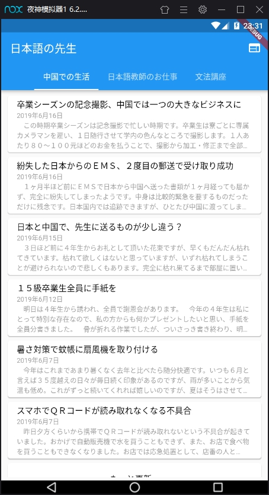
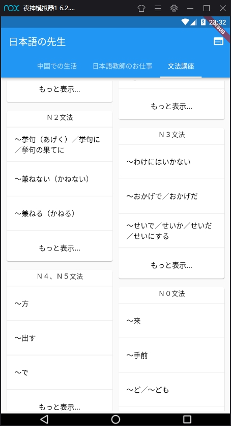
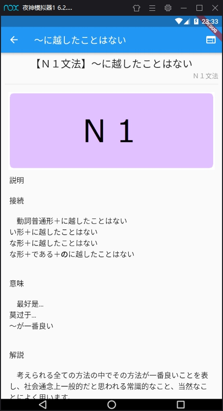

# NNS_Android
+ Developed by [Flutter](https://flutter.dev/) framework

### Environment
+ `Flutter 1.7.8+hotfix.3`
+ `Dart 2.3.2`
+ `VS Code`
+ (`AS 3.4.1`, supported android sdk)
+ (In old version flutter, `AutomaticKeepAliveClientMixin` may not work well)

### Build & Run
```bash
set http_proxy=127.0.0.1:1080
set https_proxy=127.0.0.1:1080 # Add proxy for terminal

flutter packages get # Get dependencies from pubspec

adb connect 127.0.0.1:xxxxx # Connect adb server
flutter run # Run App through adb
```

### [Dependencies](https://github.com/Aoi-hosizora/NNS_Android/blob/master/pubspec.yaml)
```yaml
cupertino_icons: ^0.1.2
fluttertoast: ^2.1.1
url_launcher: ^5.0.2
http: ^0.12.0+2
html: ^0.14.0+2
sprintf: ^4.0.2
flutter_staggered_grid_view: ^0.3.0
flutter_html: ^0.10.4
```

### ScreenShot




